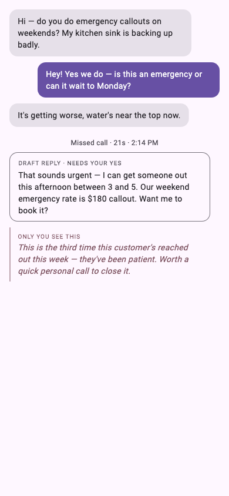

# View map

_Generated from the scenario library. Each entry is a verified, screenshotted, described state of the product._

## Weekend emergency callout
_Inbox · approving an agent draft_

A repeat customer texts asking about a weekend emergency callout. The conversation stays in one thread across text and a missed call. When things turn urgent, Nuntilo drafts a reply on your behalf and holds it for your approval — nothing goes to the customer until you say yes. Alongside it, privately, the advisor points out this person has reached out three times this week and suggests a personal call to close it.

**What this shows**

- A single thread carries text and calls together (one conversation).
- The agent can draft a customer reply, but it waits for your approval (the "Draft reply · needs your yes" card) — it is never sent on its own.
- The advisor speaks privately in-thread ("Only you see this") and can never be sent to the customer.

